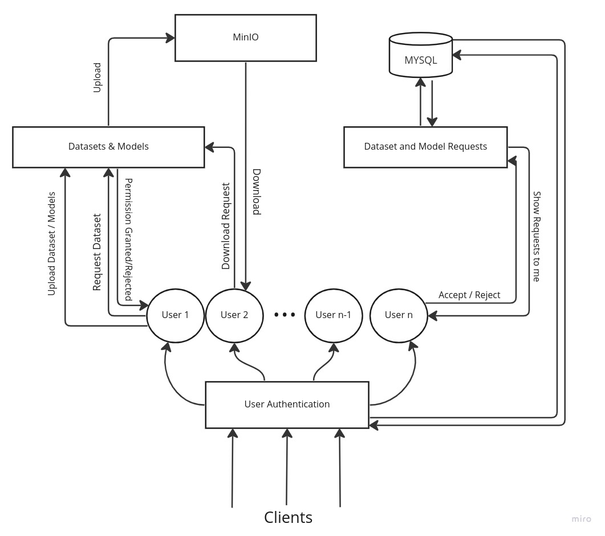

# Backend of DFS Project

### Setup
- Install mysql, and create credentials as mentioned in db.js and run `insert_data.sql`
- `npm install --no-lockfile`
- Create a .env file on root directory `dfs-backend/.env` with contents:
```
SQL_HOST="localhost"
SQL_USER="dfs"
SQL_PASSWORD="password"
SQL_DATABASE="dfsdata"
```

### Running the app
- `npm install --no-lockfile`
- `npm run-script run`
---

# DFS - Project Requirements

## Overview

The Data Foundation will host a library of digital data, and will encompass the technology-platform, infrastructure and manpower to collect, create, curate, annotate, secure and deploy it. It will be a major resource for the technology community, researchers and application developers who need such data for developing solutions driven by AI and analytics in socially-relevant domains such as Healthcare, Mobility, Buildings, Systems, and their application in the Indian context.

State of art technology in data analytics and AI available nationally and globally has proven its capabilities and benefits in several domains. Yet, critical gaps remain, as they require large, curated datasets, annotated specifically for each domain problem that needs to be addressed. Identifying and solving the problems that will streamline the building of valuable datasets is a critical need of the day. Some interesting and difficult challenges that present themselves in this context are described below.


## System Requirements

The project's web interface is mostly based on javascript. The backend is created in Node.js framework. Nodejs is used for server-side programming, and primarily deployed for non-blocking, event-driven servers, such as traditional web sites and back-end API services.

The UI is createdusing ReactJS. 
The React.js framework is an open-source JavaScript framework and library developed by Facebook. It's used for building interactive user interfaces and web applications quickly and efficiently with significantly less code than you would with vanilla JavaScript.

MYSQL database is used for storing the data

The uploading and downloading of the data will involve
MinIO. Minio is an open source distributed object storage server written in Go, designed for Private Cloud infrastructure providing S3 storage functionality. It is the best server which is suited for storing unstructured data such as photos, videos, log files, backups, and container.


## Project Deliverables

The project can be divided into different phases, with each phase having its own workflow and independent functionality. The different phases should be designed such that it is modular, scalable, and optimized. The stages of development for the project, in order of operations, are:

### System Pipeline and Operational Flow 


)


### MYSQL DATABASE

MYSQL Database has the data stored in the following form:
- DfsUser : Users are stored in this table
- Datasets :  All the Datasets are stored here
- Dataset Versions - The Datasets can have different versions. Each version is linked to its own Dataset in Dataset Schema
- Models : All the Trained models are stored here in form of `.ipynb` files
- Requests : All the requests to access a particular dataset is added here
- Model Requests : All the requests to access a particular model is added here
- Domain : Each dataset can have a domain attached to it. The domain related information is stored here.

**The Major Schemas are shown below**

**Dataset Schema**

```sql
CREATE TABLE Dataset(
    dataset_id varchar(255),
    author_id varchar(255),
    reference_list mediumtext,
    dataset_name varchar(255),
    dataset_description text,
    public boolean,
    source varchar(255),
    dataset_data LONGBLOB,
    dataset_format varchar(255),
    temporary boolean,
    dataset_status varchar(255),
    domain varchar(255),
    PRIMARY KEY (dataset_id)
);
```


**Models Schema**
```sql
CREATE TABLE Models(
    dataset_version_id varchar(255),
    dataset_id varchar(255),
    domain varchar(255),
    model_id varchar(255),
    model_name varchar(255),
    group_id varchar(255),
    author_id varchar(255),
    author_name varchar(255),
    authors_names text,
    authors_ids text,
    created_datetime varchar(255),
    last_updated varchar(255),
    updates INT,
    jsondata LONGTEXT,
    PRIMARY KEY (model_id)
);

```


**Dataset Versions  Schema**
```sql
CREATE TABLE Files(
    upfilename varchar(255),
    upfilenameMD varchar(255),
    filetype varchar(255),
    database_id varchar(255),
    databaseVersion_id varchar(255),
    comments text,
    version_name varchar(255),
    reference varchar(255),
    created_date varchar(255),
    last_edit varchar(255),
    publication_names text,
    publication_links text,
    verification varchar(255),
    public varchar(255),
    author_id varchar(255),
    PRIMARY KEY (upfilename)
)
```

**Requests   Schema**
```sql
CREATE TABLE Requests(
    upfilename varchar(255),
    upfilenameMD varchar(255),
    requester varchar(255),
    author varchar(255),
    stat varchar(255),
    comment text,
    av1 text,
    PRIMARY KEY(upfilename, requester)
);
```

Descriptions of the Fields in Schema

**Dataset Schema**


| Field | Type | Decription |
| --- | --- | --- |
| dataset_id          | varchar(255) | Uniquely determines a data |
| author_id           | varchar(255) | ID of the creator of the dataset|
| reference_list      | mediumtext   | |
| dataset_name        | varchar(255) | Name of the Dataset|
| dataset_description | text         | Decription|
| public              | tinyint(1)   | Boolean to store if dataset is public|
| source              | varchar(255) | Link to the dataset|
| dataset_data        | longblob     | |
| dataset_format      | varchar(255) | `.csv` , `.json` etc|
| temporary           | tinyint(1)   | |
| dataset_status      | varchar(255) | Approved or rejected by the Admin|
| domain              | varchar(255) | Domain to which the dataset belongs to|


**Model Schema**

| Field | Type | Decription |
| --- | --- | --- |
| dataset_version_id | varchar(255) |  Model trained in the particular dataset version|
| dataset_id         | varchar(255) |  Dataset ID on which the model is trained|
| domain             | varchar(255) |  Domain of the dataset|
| model_id           | varchar(255) | uniquely determines the model|
| model_name         | varchar(255) |  name of the model|
| group_id           | varchar(255) |  |
| author_id          | varchar(255) |  author id of the creator of model|
| author_name        | varchar(255) |  name of the author|
| authors_names      | text         |  |
| authors_ids        | text         |  |
| created_datetime   | varchar(255) |  |
| last_updated       | varchar(255) |  |
| updates            | int          |  |
| jsondata           | longtext     |  JSON string format of the uploaded `.ipynb` file|


**Requests Schema**

| Field | Type | Decription |
| --- | --- | --- |
| upfilename   | varchar(255) | Name of the uploaded file for which is requested| 
| upfilenameMD | varchar(255) | |
| requester    | varchar(255) | User ID of the Requester|
| author       | varchar(255) | Userr ID of the author|
| stat         | varchar(255) | status of the request `approved` , `rejected`, `pending`
| comment      | text         | Comments on the request|
| av1          | text         | |


---

## Sub Components

- [Authentication](./Readme_Assets/Components/Authentication.md)
- [Dataset versions](./Readme_Assets/Components/dataset_versions.md)
- [Dataset](./Readme_Assets/Components/Dataset.md)
- [Models](./Readme_Assets/Components/Models.md)
- [Request Pipeline For Dataset](./Readme_Assets/Components/request_pipeline_for_datasets.md)
- [Request Pipeline For Models](./Readme_Assets/Components/request_pipelines_for_models.md)
- [User](./Readme_Assets/Components/Users.md)


