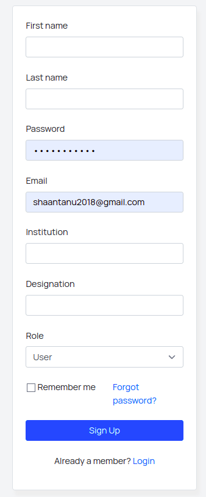
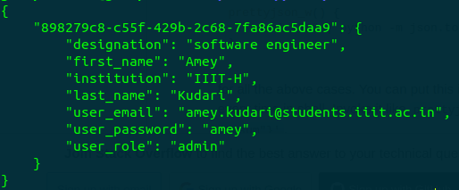

## Authentication

The authentication component in the dfs-backend project manages the authentication of the user while sending requests to the backend. It allows only authenticated and particular type of users to send particular requests which are restricted and require permissions. This component also handles timeout of the tokens. To keep a user logged in, a tokens list is active which stores the tokens of all the active users and saves it from time to time in  `tokens.js` to keep the logged in users logged in in case of server failure.

### User Schema Details 

The user in the database is stored in the following schema:
```sql
CREATE TABLE DfsUser (
    first_name varchar(255),
    last_name varchar(255),
    user_password varchar(255),
    user_email varchar(255),
    institution varchar(255),
    designation varchar(255),
    user_role varchar(255),
    PRIMARY KEY (user_email)
);
```


Most of the fields are self explainatory. The field `user_role` is essential for handling permissions. Certain routes can only be handled by the super admins and need to be restricted. In such cases, the `user_role` field comes in to play.

### Login / Register Functionalities

The signin and signup pages enables the login and logout of the users. When the form is submitted a **POST** request is sent to this endpoint when a user tries to log-in into the webapp.The **POST** request must contain the following JSON.
```
{
    'email' : email_id,
    'password' : password
}
```

When a new user wants to register , a **POST** requst is sent to this endpoint when a new user tries to register himself into this app.The **POST** request must contain the following JSON.
```
{
    'firstname': // firstname of the user,
    'lastname': // lastname of the user, 
    'email' : // email id of the user,
    'institution' : // institution the user is affliated to
    'password' : // password with necessary conditions (TO BE UPDATED),
    'designation' : // the designation of the user in the institution,
    'role' : // role of the user [User , Admin , Moderator] 
}
```
<center>

Sign In form \
 \
Signup form \


</center>

### Tokens

`tokens.json` stores the currently active tokens of the logged in users. This file is stored in the disk and thus is updated using `readFileSync()` and `writeFileSync()` methods. 

**When is the file updated?**
- When a new user logs in, a new token is created and is added to the tokens list which is present in the RAM. This list is updated in the `/login` endpoint and is then stored back in the `token.json` to keep the active tokens safe in case the server goes down.
- When a user logs out , the token held by that particular user is removed from the tokens list and is then updated back in the `token.json`.

Here is an example token which is stored in the localStorage


This token is regularly saved into `tokens.json` and it looks something like this.
<center> 



</center>