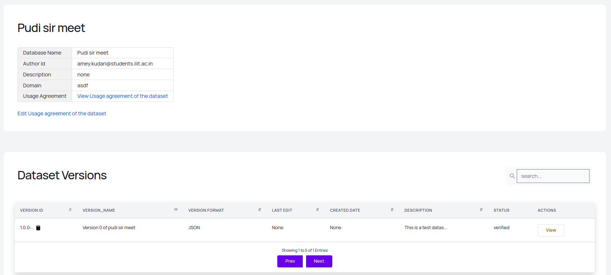

## Datasets

Datasets in DFS project are various datasets in various domains which are used to train the models. These datasets are stored in the disk using the minIO storage and retrieved when necessary. Each dataset is linked to a particular domain and a particular author. The author of the dataset is the user who has uploaded the dataset and maintains it. \
A dataset can have various versions which gets updated from time to time . These versions are managed by the dataset-versions table in the database. A dataset is basically a collection of various dataset-versions.

### The Dataset is stored in the database in the following schema.

### Dataset Schema 

|Field              |             Datatype                               |
|-------------------|-----------------------------------:|
|dataset_id               |varchar(255)       |
|author_id            |varchar(255)    
|reference_list        |mediumtext|
|dataset_name               |varchar(255)     |
|dataset_description               |text       |
|public            |boolean    
|source        |varchar(255)|
|dataset_data               |LONGBLOB     |
|dataset_format               |varchar(255)       |
|temporary            |boolean    
|dataset_status       |varchar(255)|
|domain              |varchar(255)     |
|PRIMARY KEY              |(dataset_id)     |

### Dataset entry in the database

### Dataset Upload and view UI

The Dataset page on the website shows all the datasets available under various domains. The following image shows the an example dataset.

### View Dataset Versions

When a user clicks on the versions option, he/she will be able to see all the available versions of the goven dataset.

### Adding a new dataset
A user can navigate to the `/my-data` route to view his datasets ,ie, the datasets whose author is the currently loggedn in user and he can view various versions, add new versions or add new datasets.\
The following form pops up if a user wished to add a dataset.

When a user clicks on `add dataset` button, a **POST** request is sent to `/add-dataset` when new datasets are to be added to the database. The dataset are set to `public=TRUE` and `dataset_status="APPROVED"` by default.

Each of the dataset also has a dataset usage agreement attached to it which a user must sign before using the dataset. This is linked to the terms and conditions schema in the database.

### TnC Schema

