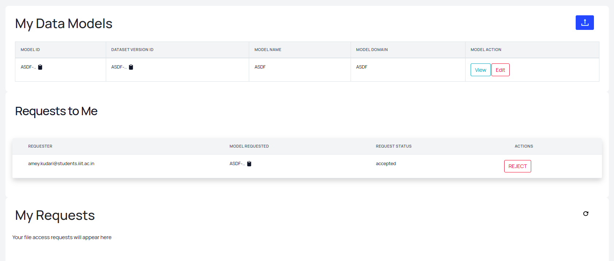

### Models

Models are the trained models and which are uploaded for usage. These models are in form of .ipynb notebooks which are **JSONIFIED** and stored in the database. The actual models are stored in Min I/O storage. 

The `jsondata` field in the schema stores the notebook in the jsonified form.

The example model entries is given below

A model can be downloaded when a user requests the model. A request is sent to the author of the model through the `model-request-pipeline`. 
The author can then `accept` / `reject` the request and on approval, the user can download the model and use it with some `terms and conditions
`. 

