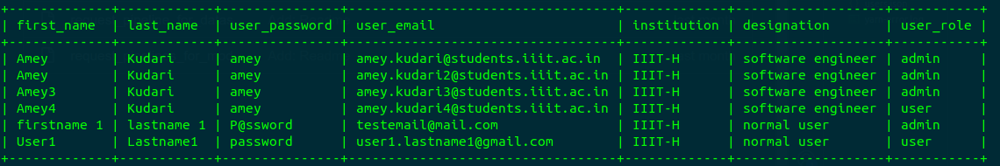
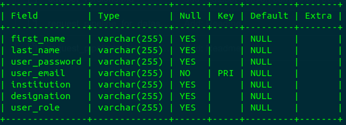

### Users

The DFSUSER is the users which are present in the database. The user can be of following types:
- user
- admin
- moderator

The admin has the highest level of permissions and rank . The moderator controls the verification and moderation of all the dataset requests or model requests. The user type is the normal user type which is the default role assigned to any user. \
Here is the example entries in the database for the users.

The database schema is given below.

