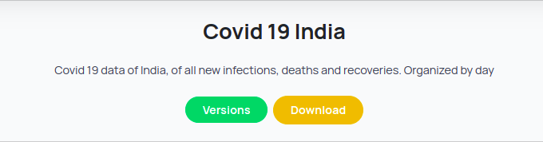

### Dataset Versions

Each dataset has its own versions . There versions have different data but they are linked to same dataset. The versions are the actual files which are downloaded when a user requests a dataset. The latests version which is present in tha database gets downloaded when a user requests for a dataset. Alternatively, a user can also specifically download a particular version by specifying the appropriate `dataset-version-id` in the request. \
The information about various dataset versios in present in the dataset page which opens up when a user clicks the `versions` buttom under a given dataset in the Datasets page.

### Database in Schema

An example entry in the database looks like this

### Dataset version UI

A new version can be addedto the dataset of which a person is author. The following form in `\add-dataset` enables a user to add a new version to the existing dataset.

