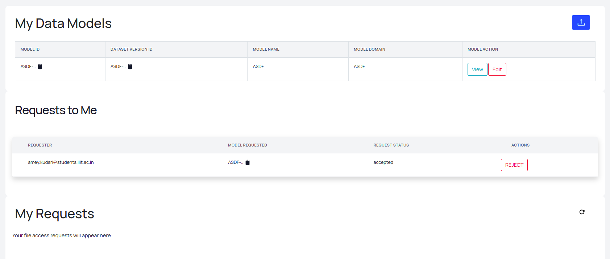

### Request Pipelines For Models

Model Request Schema:

Model Request Entry Entry:

A model can be downloaded when a user requests the model. A request is sent to the author of the model through the `model-request-pipeline`. 
The author can then `accept` / `reject` the request and on approval, the user can download the model and use it with some `terms and conditions
`. 

